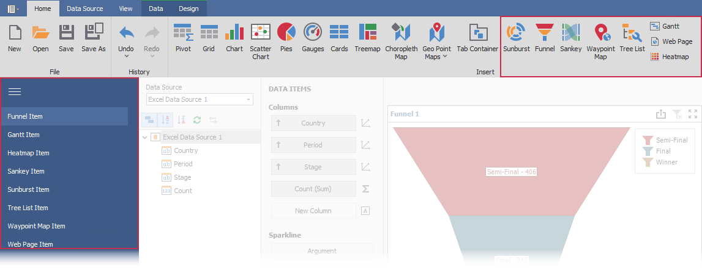
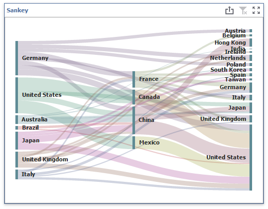
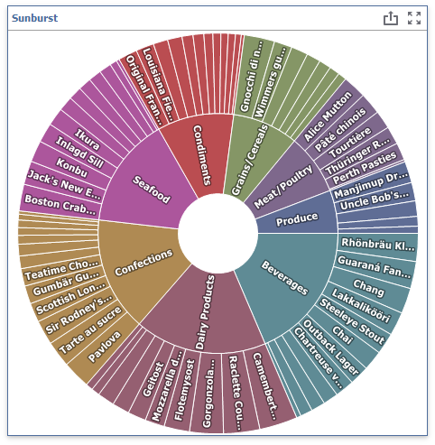
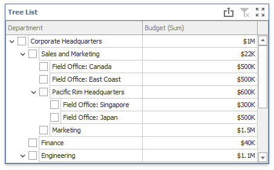
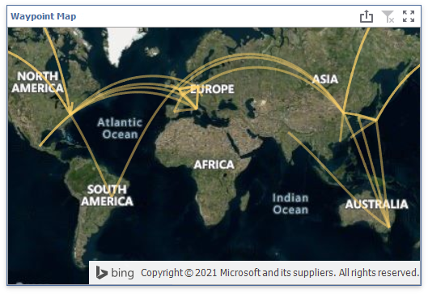
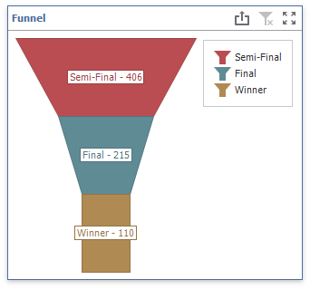
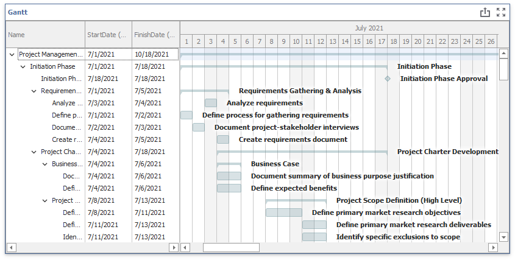
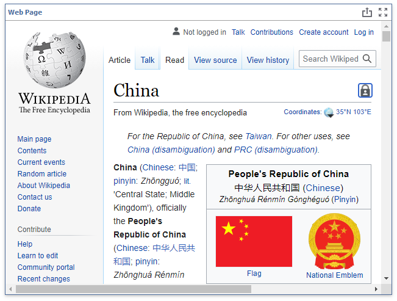
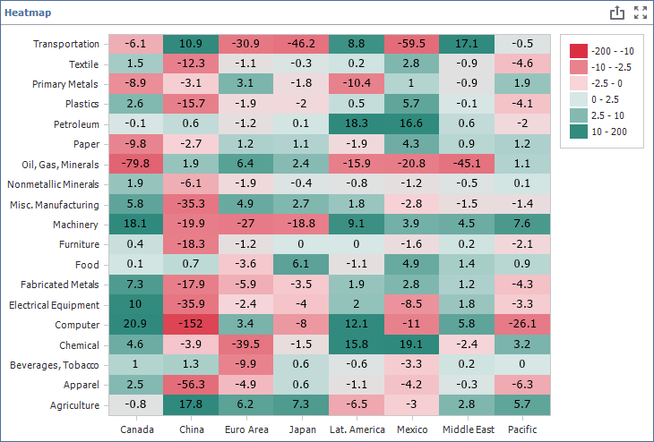

<!-- default badges list -->

[](https://supportcenter.devexpress.com/ticket/details/T1023113)
[](https://docs.devexpress.com/GeneralInformation/403183)
[](#does-this-example-address-your-development-requirementsobjectives)
<!-- default badges end -->
# Dashboard for WinForms - Custom Item Extensions

This example contains the source code of the most requested custom items. Custom items allow you to embed any WinForms control into a [Dashboard](https://www.devexpress.com/products/net/dashboard/). You can use the complete custom items from this example as they are, or modify them according to your needs. 
In a test dashboard of this example, you can add custom items from the Ribbon and switch between tabs in the [ribbon UI main menu](https://docs.devexpress.com/WindowsForms/5482/controls-and-libraries/ribbon-bars-and-menu/common-features/look-and-feel) at the left edge to display each custom item on the [dashboard surface](https://docs.devexpress.com/Dashboard/18205/winforms-dashboard/winforms-designer/ui-elements/dashboard-surface?p=netframework).



## Prerequisites  

A custom [Web Page](#custom-web-page-item) item requires [WebView2 Runtime](https://developer.microsoft.com/en-us/microsoft-edge/webview2/) to be installed on your machine.

## Example Overview

The example consists of two projects: 
* [CustomItemExtension](CS/CustomItemExtension) (VB: [CustomItemExtension](VB/CustomItemExtension))

    Contains the source code of custom items and can be used in customer solutions. 

* [CustomItemTest](CS/CustomItemExtension) (VB: [CustomItemTest](VB/CustomItemExtension))

    Contains a dashboard with custom items and can be used as a test project.


Refer to the following list for detailed item descriptions:

- [Custom Sankey item](#custom-sankey-item)

- [Custom Sunburst item](#custom-sunburst-item)

- [Custom Tree List item](#custom-tree-list-item)

- [Custom Waypoint Map item](#custom-waypoint-map-item)

- [Custom Funnel item](#custom-funnel-item)

- [Custom Gantt item](#custom-gantt-item)

- [Custom Web Page Item](#custom-web-page-item)

- [Custom Heatmap Item](#custom-heatmap-item)

### Custom Sankey Item
View file: ([C#](CS/CustomItemExtension/CustomItems/SankeyChart)/[VB](VB/CustomItemExtension/CustomItems/SankeyChart))

The Sankey diagram visualizes data as weighted flows or relationships between nodes.



This custom item implements the following [functionality](https://docs.devexpress.com/Dashboard/403031/winforms-dashboard/winforms-designer/create-a-custom-item?p=netframework):
* Master-Filter
* Coloring
* Export

### Custom Sunburst Item
View file: ([C#](CS/CustomItemExtension/CustomItems/SunburstChart)/[VB](VB/CustomItemExtension/CustomItems/SunburstChart))

The Sunburst chart combines a Treemap and Pie chart to visualize hierarchical data in a circular layout.



This custom item implements the following [functionality](https://docs.devexpress.com/Dashboard/403031/winforms-dashboard/winforms-designer/create-a-custom-item?p=netframework):
* Master-Filter
* Coloring
* Export

### Custom Tree List Item
View file: ([C#](CS/CustomItemExtension/CustomItems/TreeList)/[VB](VB/CustomItemExtension/CustomItems/TreeList))

The hybrid item combines a Tree List and Grid. The Tree List uses the parent-child relationships to generate the hierarchical data structure.



This custom item implements the following [functionality](https://docs.devexpress.com/Dashboard/403031/winforms-dashboard/winforms-designer/create-a-custom-item?p=netframework):
* Master-Filter
* Export


### Custom Waypoint Map Item

View file: ([C#](CS/CustomItemExtension/CustomItems/WaypointMap)/[VB](VB/CustomItemExtension/CustomItems/WaypointMap))

The Waypoint map visualizes data as linked points.



This custom item implements the following [functionality](https://docs.devexpress.com/Dashboard/403031/winforms-dashboard/winforms-designer/create-a-custom-item?p=netframework):
* Master-Filter
* Export


### Custom Funnel Item

View file: ([C#](CS/CustomItemExtension/CustomItems/Funnel)/[VB](VB/CustomItemExtension/CustomItems/Funnel))

The Funnel chart visualizes the progressive reduction of data as it passes from one stage to another in a process or procedure.



This custom item implements the following [functionality](https://docs.devexpress.com/Dashboard/403031/winforms-dashboard/winforms-designer/create-a-custom-item?p=netframework):
* Master-Filter
* Drill-Down
* Coloring
* Export

### Custom Gantt Item

View file: ([C#](CS/CustomItemExtension/CustomItems/GanttItem)/[VB](VB/CustomItemExtension/CustomItems/GanttItem))

The Gantt chart visualizes project schedule data as bars.



This custom item implements the following [functionality](https://docs.devexpress.com/Dashboard/403031/winforms-dashboard/winforms-designer/create-a-custom-item?p=netframework):
* Master-Filter
* Export


### Custom Web Page Item

View file: ([C#](CS/CustomItemExtension/CustomItems/WebPageItem)/[VB](VB/CustomItemExtension/CustomItems/WebPageItem))

The Web Page displays the web content. You can specify the URI pattern to create the page address from a data column at run-time.



This custom item implements the following [functionality](https://docs.devexpress.com/Dashboard/403031/winforms-dashboard/winforms-designer/create-a-custom-item?p=netframework):
* Master-Filter
* Export


### Custom Heatmap Item

View file: ([C#](CS/CustomItemExtension/CustomItems/Heatmap)/[VB](VB/CustomItemExtension/CustomItems/Heatmap))

The Heatmap item uses color variation to show the relationship between two dimensions.



This custom item implements the following [functionality](https://docs.devexpress.com/Dashboard/403031/winforms-dashboard/winforms-designer/create-a-custom-item?p=netframework):
* Export
* Coloring

## Example Structure

Custom item files are stored in the _CustomItems_ folder. Each custom item has the following classes:

### CustomItemExtensionModule

Implements the `IExtensionModule` interface with the following methods:

* `AttachViewer` / `AttachDesigner`

	Execute the binding code. Subscribe the `CustomDashboardItemControlCreating` event, create custom item bars, and remove buttons from the Ribbon if necessary. For example, the custom Sunburst item does not support Drill-Down. The `RemoveDrillDownBarItem` method removes this option from the Ribbon. 
* `DetachViewer` / `DetachDesigner`

	Execute the unbinding code. Unsubscribe from the `CustomDashboardItemControlCreating` event.
	
### CustomItemMetaData 

Contains metadata for a custom item that describes options and settings available to a user in the UI. 

### CustomItemControlProvider 

Contains configuration settings for a custom control. A custom control displays a custom item in a dashboard.

This class contains the following methods:

* `CustomItemControlProvider ()` - [provider](https://docs.devexpress.com/Dashboard/DevExpress.DashboardWin.CustomControlProviderBase) constructor. This is where the default control settings and event subscriptions are performed.

* [UpdateControl](https://docs.devexpress.com/Dashboard/DevExpress.DashboardWin.CustomControlProviderBase.UpdateControl(DevExpress.DashboardCommon.CustomItemData))

	 - Creates and updates a custom control.

	 - Creates a custom item data source.

	 - Validates data members in metadata.

	 - Binds custom item to data.

	 - Sets Master Filter mode and Drill-Down.

* [GetPrintableControl](https://docs.devexpress.com/Dashboard/DevExpress.DashboardWin.CustomControlProviderBase.GetPrintableControl(DevExpress.DashboardCommon.CustomItemData-DevExpress.DashboardCommon.CustomItemExportInfo)) 

	 Obtains the printable control to export a custom item. You need to create a `PrintableComponentContainer` from the current custom control.  

* [SetSelection](https://docs.devexpress.com/Dashboard/DevExpress.DashboardWin.CustomControlProviderBase.SetSelection(DevExpress.DashboardWin.CustomItemSelection))

	Updates a custom control according to the current master filter selection. 


The _Images_ folder contains icons for custom items and their options. 

The file that is used for an icon must be embedded in the file assembly. The file’s [BuildAction](https://docs.microsoft.com/en-us/visualstudio/ide/build-actions?view=vs-2019) property is set to `Embedded Resource`.
 
 
## Integrate a Custom Item to Your Project

### Add Custom Items 

You can add custom items to your project one of the following ways:

* Add the [CustomItemExtension](CS/CustomItemExtension) (VB: [CustomItemExtension](VB/CustomItemExtension)) project to your solution. Add a reference to this project to "References" in your project with a dashboard control.

* Install the [NuGet package](https://www.nuget.org/packages/DevExpress.Win.Dashboard.CustomItemExtension/). 

### Register Custom Items

1. Register the [CustomItemMetadata](https://docs.devexpress.com/Dashboard/DevExpress.DashboardCommon.CustomItemMetadata) type for a custom item and attach its module in your application:

For example, call the following code to register the `SankeyItemMetadata` type in your application:

**C# code**:
```csharp
using DevExpress.DashboardWin.CustomItemExtension;
using DevExpress.DashboardCommon;

namespace CustomItemsSample {
    static class Program {
        /// <summary>
        /// The main entry point for the application.
        /// </summary>
        [STAThread]
        static void Main() {
            //...
            Dashboard.CustomItemMetadataTypes.Register<SankeyItemMetadata>();
            Application.Run(new Form1());
        }
    }
}
```

**VB code**: 
```vb
Imports DevExpress.DashboardWin.CustomItemExtension
Imports DevExpress.DashboardCommon

Namespace CustomItemsSample
    Friend NotInheritable Class Program
        ''' <summary>
        ''' The main entry point for the application.
        ''' </summary>
        Private Sub New()
        End Sub
        <STAThread> _
        Shared Sub Main()
          '...
          Dashboard.CustomItemMetadataTypes.Register(Of SankeyItemMetadata)()
          Application.Run(New Form1())
        End Sub
    End Class
End Namespace
```
2. Call the following code to attach the extension to the `DashboardDesigner` control:

**C# code**:
```csharp
using DevExpress.XtraBars.Ribbon;
using DevExpress.DashboardWin.CustomItemExtension; 

public Form1() {
        InitializeComponent();
	var sankeyItemModule = new SankeyItemExtensionModule();
	dashboardDesigner1.CreateRibbon();
        sankeyItemModule.AttachDesigner(dashboardDesigner1);
}
``` 

**VB code**: 
```vb
Imports DevExpress.XtraBars.Ribbon
Imports DevExpress.DashboardWin.CustomItemExtension

Public Sub New()
	InitializeComponent()
	Dim sankeyItemModule = New SankeyItemExtensionModule()
	dashboardDesigner1.CreateRibbon()
	sankeyItemModule.AttachDesigner(dashboardDesigner1)
End Sub 
```
## Documentation

- [Custom Item Tutorials](http://docs.devexpress.com/Dashboard/403031/winforms-dashboard/winforms-designer/create-a-custom-item#tutorials)
- [Custom Item Troubleshooting](https://docs.devexpress.com/Dashboard/403250/winforms-dashboard/winforms-designer/create-a-custom-item/custom-item-troubleshooting)


## More Examples

[Custom Items - Tutorial](https://github.com/DevExpress-Examples/winforms-dashboard-custom-items)
<!-- feedback -->
## Does this example address your development requirements/objectives?

[](https://www.devexpress.com/support/examples/survey.xml?utm_source=github&utm_campaign=winforms-dashboard-custom-items-extension&~~~was_helpful=yes) [](https://www.devexpress.com/support/examples/survey.xml?utm_source=github&utm_campaign=winforms-dashboard-custom-items-extension&~~~was_helpful=no)

(you will be redirected to DevExpress.com to submit your response)
<!-- feedback end -->
